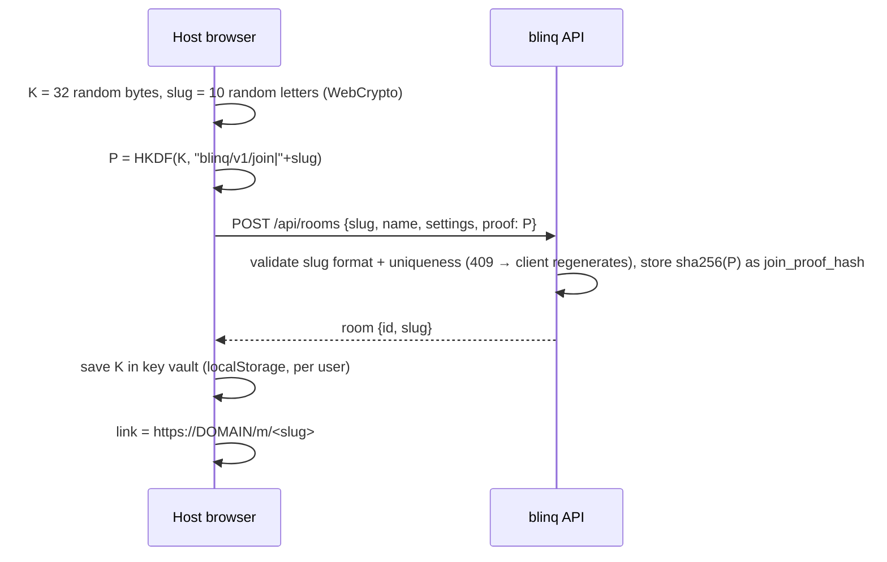
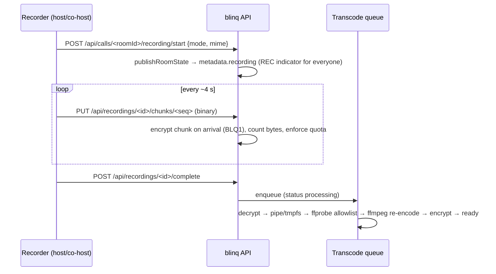

# Architecture

This document explains how blinq is put together and why. Exact contracts (endpoints, payloads, LiveKit metadata,
data topics, error codes) live in [`API.md`](API.md). Security reasoning lives in [`SECURITY.md`](SECURITY.md).

## 1. Components

| Component | Technology | Responsibility |
|---|---|---|
| Web app | Nuxt 4 (Vue 3.5, shadcn-vue, Tailwind 4), TypeScript | All UI: auth, dashboard, admin, pre-join, call, recordings |
| API | Nitro server routes inside the same Nuxt app | Auth, sessions, users, rooms, invites, join/lobby, LiveKit tokens, host actions, recordings, admin, webhooks |
| Database | PostgreSQL 18 + Drizzle ORM | Accounts, sessions, rooms, meetings, participants, recordings metadata, settings, audit |
| Media server | LiveKit v1.13 (SFU) with embedded TURN | Forwards E2EE-encrypted media and data; simulcast/dynacast; TURN/UDP and TURN/TLS |
| Reverse proxy | Caddy 2.11 + caddy-l4 | Automatic HTTPS, HTTP/3, SNI routing of TURN/TLS on 443, security headers (HSTS), body limits |
| Transcoder | ffmpeg 9 (static binary inside the app image) | Converts uploaded recordings to faststart H.264/AAC MP4 |
| Mail (optional) | SMTP via nodemailer | Account invites, email verification, password reset |

Everything runs with `docker compose up`. There is no Redis and no separate backend service: one app instance, one
LiveKit node.

## 2. Production topology

```
                       ┌──────────────────────── Linux host (Docker, host networking) ───────────────────────┐
Browser ─HTTPS/H3 :443─┤► Caddy ──► Nitro app 127.0.0.1:3000  (UI + /api)                                    │
        ─WSS  :443 ────┤► Caddy ──► LiveKit   127.0.0.1:7880  (path /rtc, /rtc/* only — signaling)           │
        ─TLS  :443 ────┤► Caddy L4 (SNI = TURN_DOMAIN, TLS terminated, PROXY v2) ──► LiveKit TURN :5349      │
        ─UDP  3478 ────┤► LiveKit TURN/UDP                                                                    │
        ─TCP  7881 ────┤► LiveKit ICE/TCP                                                                     │
        ─UDP 50000-60000►  LiveKit media (SRTP carrying E2EE-encrypted frames)                                │
                       │  Nitro ──unix socket──► Postgres (network_mode: none)                                 │
                       │  Nitro ──http──► LiveKit RoomService (127.0.0.1:7880, /twirp never public)           │
                       │  LiveKit ──webhook──► Nitro 127.0.0.1:3000/api/webhooks/livekit                      │
                       │  Nitro ──► /data/recordings (BLQ1 encrypted) · tmpfs /work (transcoding)            │
                       └──────────────────────────────────────────────────────────────────────────────────────┘
```

Why this shape:
- **LiveKit uses host networking** (official guidance). ICE candidates advertise the node IP with ports from
  50000–60000, and TURN relays loop back to the SFU. Docker bridge NAT would break relay permissions and would need
  tens of thousands of published ports. Caddy and the app share host networking so they can reach LiveKit on
  loopback. The app binds `127.0.0.1` only (`NITRO_HOST`), so everything public goes through Caddy.
- **Postgres has no network at all.** It runs with `network_mode: none` and a unix socket shared through a named
  volume. It cannot be exposed by accident, which also avoids old Docker loopback-publish leaks.
- **Signaling is same-origin** (`wss://DOMAIN/rtc/v1`, with fallback to `/rtc`), so the CSP can use
  `connect-src 'self'` and one image works for any domain.
- **TURN/TLS needs its own hostname.** LiveKit always advertises `turns:TURN_DOMAIN:443?transport=tcp`, so Caddy
  routes TLS connections by SNI:
  - `TURN_DOMAIN` is terminated by Caddy and proxied with the PROXY protocol to LiveKit's plaintext TURN listener.
  - Everything else goes to the normal HTTPS server.
  - This makes calls work in networks where only TCP 443 is allowed.

Ports: see the table in [`DEPLOYMENT.md`](DEPLOYMENT.md). Public: 80/tcp, 443/tcp+udp, 3478/udp, 7881/tcp,
50000–60000/udp (plus 30000–40000/udp only on 1:1-NAT clouds). Everything else is loopback or socket only.

## 3. Development topology

- `pnpm dev` runs Nuxt natively on the host (default port 3000; each sub-agent uses its own port and database).
- `pnpm dev:deps` starts `docker-compose.dev.yml` (project name `blinq-dev`, ports bound to `127.0.0.1`):
  - Postgres on 55432.
  - LiveKit in bridge mode: HTTP 7880, ICE/TCP 7881, UDP mux 7882. `node_ip` is the LAN IP from
    `scripts/detect-ip.sh`, because Firefox rejects loopback ICE candidates. Webhooks go to
    `host.docker.internal:3000–3005`.
  - Mailpit (SMTP 1025, UI 8025).
- E2E tests run a test build (`BLINQ_TEST_HOOKS=1`) behind a small Caddy (`docker/e2e/Caddyfile`), so the app and
  `/rtc` are same-origin and the production CSP applies unchanged.
- The production compose file needs Linux host networking. `scripts/smoke-prod.sh` exercises it inside the Docker
  VM (with `TLS_MODE=internal`) on macOS and in CI.

## 4. Application structure

```
app/  (Nuxt srcDir)                         server/ (Nitro)                        shared/
  pages ── components ── composables          api/**  thin handlers                  schemas/<domain>.ts (zod)
    │           │             │                 │                                    utils/error-codes/*
    └──── stores (Pinia) ◄────┘                 ▼                                    utils/permissions.ts
                │                            services/<domain>  ◄── contracts/**     types/*
                ▼                               │
  lib/e2ee  lib/livekit  lib/call/features/*    ▼
  lib/media lib/recording lib/layout         database (Drizzle schema, migrations)
```

- **Server layering:** handlers authenticate (`requireUser`, `requireAdmin`, `resolveCaller`), validate with the
  shared zod schema, call a service and return. Services own all DB and LiveKit access. Server-internal interfaces
  live in `server/contracts/` so parallel work can code against them: `RoomServiceAdapter`, `EventBus`, `Clock`,
  `publishRoomState`.
- **Client layering:** pages compose feature components. Call logic lives in plain TypeScript modules under
  `app/lib/**`, which are unit-testable without Vue. Pinia stores hold call state; LiveKit objects are `markRaw`.
- **Extension points:** the call UI discovers features through `import.meta.glob` registries: control-bar items,
  side panels, tile badges, pre-join slots and settings sections. A feature is a folder under
  `app/lib/call/features/<feature>/` plus `app/components/call/<feature>/`. Adding one never edits the core call
  page.
- **Startup:** Nitro v2 does not await async plugins, so the container entrypoint runs
  `cli.mjs migrate && cli.mjs bootstrap` (under a Postgres advisory lock, idempotent) before `index.mjs`.
- **Scheduled tasks:** Nitro tasks handle recording retention, stale uploads and partial finalize, expired
  sessions/invites/guest sessions, and IP/audit retention.

## 5. Data model

| Table | Purpose |
|---|---|
| `users` | Accounts (`admin` or `user`), argon2id password hash, forced password change, disabled flag |
| `auth_identities` | Provider + subject per user (`password`, later `oidc:<id>`) — OIDC without schema changes |
| `sessions` | Server-side sessions (`id = sha256(token)`), absolute and idle expiry, IP and user agent |
| `user_invites` | Account invites (hashed token, role, optional or required email, expiry, single use) |
| `email_tokens` | Email verification and password-reset tokens (hashed, expiring, single use) |
| `login_throttle` | Backoff state per email, IP and IPv6 /64 |
| `settings` | Admin settings (jsonb, zod-typed with defaults) |
| `rooms` | Persistent or ephemeral rooms: owner, slug, optional password hash, **join proof hash**, policies, limits |
| `room_members` | Persisted co-hosts (registered users) |
| `room_invites` | Invite links (expiry, max uses, use count, revoked) — the token itself is derived, never stored |
| `guest_sessions` | Guest identities per room (hashed token, name, expiry) |
| `meetings` | One live meeting per room at a time (unique partial index), random **epoch**, LiveKit room SID |
| `call_participants` | Lobby, roster and bans per meeting: LiveKit identity, role, status, mic/camera allowance, volume |
| `recordings` | Recording lifecycle and metadata; the file itself is BLQ1-encrypted on disk |
| `audit_log` | Security-relevant actions (admin, host, recordings access) with actor, IP and details |

Conventions:
- Primary keys are `uuid` with `uuidv7()` defaults (time-ordered).
- Timestamps are `timestamptz` in UTC.
- Emails are stored lowercased.
- Soft delete (`deleted_at`) only where history matters (rooms). Everything else is deleted for real.

## 6. Key flows

### 6.1 Room creation and the room key



The server never learns `K`. It only stores a hash of a one-way derivative, which lets it refuse tokens to people
who don't hold the key.

### 6.2 Joining (invitee or guest, waiting room on)

```mermaid
sequenceDiagram
  participant G as Guest browser
  participant A as blinq API
  participant L as LiveKit
  participant H as Host browser
  G->>G: first plugin: read #k and #t, store in sessionStorage, strip fragment
  G->>A: POST /api/join/<slug>/info {proof, inviteToken}
  A-->>G: room name, needsPassword, waitingRoom, recordingActive
  G->>G: pre-join (preview, devices, name); preload SDK + E2EE worker
  G->>A: POST /api/join/<slug> {proof, inviteToken, displayName, password?, clientId}
  A->>A: validate invite, lock, guests policy, password, capacity, bans
  A-->>G: {waiting, requestId} + per-room guest cookie
  A->>L: sendData(blinq.srv.v1 "lobby.changed") to hosts only
  H->>A: GET /api/calls/<roomId>/lobby  (hint → refetch)
  H->>A: POST /api/calls/<roomId>/lobby/<reqId>/admit
  G->>A: GET /api/join/requests/<reqId>/events (SSE, owner cookie only)
  A->>A: ensure meeting (epoch) + CreateRoom if needed; mint token for G's own row
  A-->>G: SSE admitted {token, url, epoch, identity}
  G->>G: derive media/chat keys from K + epoch
  G->>L: connect (E2EE on), publish pre-acquired tracks, subscribe encrypted publications only
```

Hosts and co-hosts skip the lobby and get their token directly from `POST /api/join/<slug>`. A refresh reuses the
same `call_participants` row only when session + `clientId` + live meeting all match.

### 6.3 Meeting lifecycle

- The first admitted join creates the `meetings` row with a fresh random epoch and calls `CreateRoom`
  (`maxParticipants`, timeouts, metadata). LiveKit's `auto_create` is off, so tokens alone can never create rooms.
- Webhooks (`participant_joined/left`, `room_started/finished`) update `call_participants` and `meetings`. They
  are deduplicated by event id.
- **Enforcement:** a participant whose row isn't admitted or joined is removed by the `participant_joined` handler.
- `room_finished` closes the meeting. The next meeting gets a new epoch, and therefore new media and chat keys.

### 6.4 Host actions

A host action goes: UI → `POST /api/calls/<roomId>/...` → the permission matrix (`shared/utils/permissions.ts`)
checks the caller's role → service → LiveKit RoomService. The affected client then observes the change through
LiveKit: track muted, permission changed, attributes changed, disconnected.

Mute-all and permission changes recompute the full `ParticipantPermission` object. Room-level state changes go
through `publishRoomState`.

### 6.5 Recording



The compositor draws the whole participant grid onto a canvas using a Worker clock. Audio is mixed with WebAudio
from encrypted-verified tracks only.

Local-only mode records the same way but saves the file on the recorder's device. Nothing is uploaded.

## 7. Client call architecture

- **Call page state machine:**
  `loading → needKey → info → prejoin → password → waiting → connecting → inCall → (left | ended | removed | error)`.
- **Room factory** (`app/lib/livekit/room-factory.ts`) creates the Room with these options: `encryption`
  (ExternalE2EEKeyProvider with a 256-bit key plus the worker), `autoSubscribe: false`, `adaptiveStream: false`,
  `dynacast: true`, VP8 simulcast, no backup codec, RED off, DTX on.
- **SubscriptionManager** is a pure policy function. Its inputs are the layout page, tile pixel sizes, visibility,
  pin, screen share, recording demand and each publication's encryption. Its output is the desired state per
  publication: subscribed, enabled, dimensions. A thin applier calls `setSubscribed`, `setEnabled` and
  `setVideoDimensions`. Unit-tested.
- **AudioEngine:**
  - Playback uses media elements. Per-participant volume is multiplied by the host-set `vol` attribute.
  - The speaker picker appears only where `supportsAudioOutputSelection()`.
  - The mic chain (48 kHz AudioContext) is: optional RNNoise → GainNode (own mic gain). The recording mixer uses
    its own AudioContext.
- **Layout math** (`app/lib/layout/`) computes grid columns/rows and tile sizes for 1–25 tiles and each viewport
  class (phone paging). Pure and unit-tested.

## 8. Configuration

- **Environment** (`.env`, validated at boot by `server/utils/env.ts`): infrastructure and secrets. Covers domains,
  TLS mode, secrets, database, LiveKit ports and node IP, SMTP, logging, recording paths. See `.env.example`.
- **Admin settings** (database, editable live in the admin panel): registration mode and allowed domains, guests
  allowed, media quality limits, participant and room limits, recording switch/retention/limits/quota, privacy
  retention. Defaults and keys are listed in [`API.md`](API.md).
- **Public client config** (`GET /api/config`): the subset of settings and features the browser needs, so the
  same image works for every domain.

## 9. Observability

- **App logs:** consola, human-readable by default, `LOG_FORMAT=json` for log shippers.
  - Every request logs method, route, status, duration and request id. Secrets and tokens are redacted.
  - At startup it prints a one-line summary: version, public URL, TURN/SMTP status, registration mode.
- **Caddy:** JSON access logs with the `access_token` query parameter redacted.
- **LiveKit:** logs at `info`.
- **Health:**
  - `GET /api/health` (liveness) and `GET /api/ready` (database + LiveKit reachable).
  - Each container has a Docker healthcheck. Docker logs rotate (json-file, size-limited).

## 10. Scaling and limits

- Designed for one node: up to 25 participants per room, several concurrent rooms depending on CPU and bandwidth.
  Measured numbers are in [`PERFORMANCE.md`](PERFORMANCE.md).
- The event bus (lobby notifications) and limiter stores are in-process behind interfaces. A multi-node setup
  would swap them for Postgres `LISTEN/NOTIFY` or Redis and add LiveKit's Redis mode (backlog).
