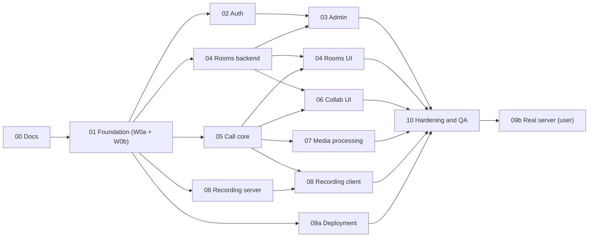

# Roadmap

This is the single place that tracks stage status, dependencies, waves and file ownership. Every stage has a
detailed file in `docs/stages/` with tasks and a Definition of Done (DoD).

Status values: `todo` → `in progress` → `review` → `done`. Only the orchestrator changes this table, after merging
and verifying a stage.

## Status

| Stage | Title | Owner(s) | Wave | Depends on | Status |
|---|---|---|---|---|---|
| [00](stages/00-docs-and-planning.md) | Docs and planning | orchestrator + doc agents | W0-docs | — | done |
| [01](stages/01-foundation.md) | Foundation | orchestrator (W0a); server-core, ui-shell, devops-ci (W0b) | W0 | 00 | done |
| [02](stages/02-auth-and-accounts.md) | Auth and accounts | auth | W1 | 01 | done |
| [03](stages/03-admin-panel.md) | Admin panel | admin | W2 | 02, 04 (backend) | done |
| [04](stages/04-rooms-invites-join.md) | Rooms, invites, join, E2EE keys | rooms-backend (W1), rooms-ui (W2) | W1 / W2 | 01; UI also 05 | done |
| [05](stages/05-call-core.md) | Call core | call-core | W1 | 01 | done |
| [06](stages/06-host-controls-collaboration.md) | Host controls and collaboration | collab-ui | W2 | 04 (backend), 05 | done |
| [07](stages/07-media-processing.md) | Media processing | media-fx | W2 | 05 | done |
| [08](stages/08-recording.md) | Recording | recording-server (W1), recording-client (W2) | W1 / W2 | 01; client also 05 and 08 (server) | done |
| [09](stages/09-production-deployment.md) | Production deployment | infra (9a, W1); user (9b) | W1 / final | 01 (9a); 10 (9b) | 9a done; 9b needs a real server (user) |
| [10](stages/10-hardening-qa-release.md) | Hardening, QA and release | e2e, security-review, quality-review, fix agents, docs | W3 | all | in progress |

## Dependency graph

## Waves and merge train

At most five sub-agents run at the same time. Each works in its own git worktree and branch. The orchestrator
merges, runs the full gate, and commits locally. **Nothing is pushed** until the user asks.

| Wave | Agents | Starts when |
|---|---|---|
| W0-docs | orchestrator, doc agent A (stages 00–05 + API), doc agent B (stages 06–10 + TESTING/DEPLOYMENT/PERFORMANCE/README) | now |
| W0a | orchestrator: scaffold, dependencies, configs, contracts, schema, stubs, dev stack, scripts | W0-docs merged |
| W0b | `server-core`, `ui-shell`, `devops-ci` | W0a committed (wave base SHA recorded below) |
| W1 | `auth`, `rooms-backend`, `call-core`, `recording-server`, `infra` | W0b merged |
| W2 | `admin` (after auth + rooms-backend), `rooms-ui` (after rooms-backend + call-core), `collab-ui` (after rooms-backend + call-core), `media-fx` (after call-core), `recording-client` (after call-core + recording-server) | each as soon as its dependencies are merged |
| W3 | `e2e`, `security-review`, `quality-review`, fix agents grouped by owner area, `docs` | W2 merged |
| Final | Stage 9b and the manual browser matrix | user |

**Merge gate** (after every merge):
- `pnpm lint`, `pnpm typecheck`, `pnpm test`, `pnpm test:api`, `pnpm build` and `pnpm check:english` pass.
- The merged agent's E2E area passes.
- This table is updated, the result is committed, and the worktree is removed.

**Wave gate** (once, after the last merge of a wave): the full E2E suite (every project), a clean `docker build` and
`sh scripts/smoke-prod.sh` (4–6 min with cached images).

Agent ports (W2): `rooms-ui` 3002, `collab-ui` 3003, `media-fx` 3004, `recording-client` 3005, `admin` 3006 (no LiveKit
webhooks needed). 3000 and 3001 stay free for the maintainer's own dev server. On this machine another project holds
port 8080, so E2E runs use `E2E_HTTP_PORT=8090`.

Wave base SHAs (filled in by the orchestrator):

| Wave | Base SHA |
|---|---|
| W0b | a24cccf |
| W1 | 2f8fe39 (call-core, infra); see change log for auth, rooms-backend, recording-server |
| W2 | see change log (2026-10-03) |
| W3 | see change log (2026-10-03, `chore(w3): kickoff`) |

## Ownership map

Every path in the repository has exactly one owner at a time. Paths not listed under an agent belong to the
orchestrator. Paths of finished waves (W0b, W1) belong to the orchestrator again; later agents request changes there. "Frozen" paths change only through the orchestrator, after an agent requests the change in its report.

### Orchestrator (frozen for everyone else)

- `package.json`, `pnpm-lock.yaml`, `pnpm-workspace.yaml`, `.node-version`, `.npmrc`
- `nuxt.config.ts`, `app.config.ts`, `tsconfig*.json`, `eslint.config.mjs`, `.prettierrc*`, `vitest.config.ts`,
  `playwright.config.ts`, `drizzle.config.ts`, `components.json`
- `.gitignore`, `.editorconfig`, `.dockerignore`, `.worktreeinclude`, `.claude/**`
- `AGENT.md`, `CLAUDE.md`, `docs/ROADMAP.md`, `docs/ARCHITECTURE.md`, `docs/SECURITY.md`, `docs/API.md`
- `.env.example`, `.env.dev.example`, `server/utils/env.ts`, `server/utils/api-error.ts`
- `server/database/**` (schema + migrations), `server/contracts/**` (server-internal interfaces)
- `shared/**` (schemas, error codes, permission matrix types, constants)
- `app/lib/contracts/**` (client-internal interfaces), `app/lib/e2ee/**` (key derivations, proof, envelope; key
  vault excepted, see rooms-ui), `app/composables/useApi.ts`
- `app/components/ui/**` (shadcn-vue), `app/layouts/**` and navigation after W0b
- `.github/workflows/**` and `docker-compose.dev.yml` after W0b
- `tests/e2e/fixtures/index.ts` (merges base, livekit, media, recording), `tests/tsconfig.json`

### W0b

| Owner | Paths |
|---|---|
| `server-core` | `server/middleware/**` (incl. the password-change guard), `server/plugins/**`, `server/utils/**` (except `env.ts` and `api-error.ts`), `server/tasks/maintenance/**`, `server/services/{session,settings,audit}/**`, `server/api/{health,ready,config}.get.ts`, `server/cli.ts`, `scripts/build-cli.mjs`, `tests/api/_harness/**`, `tests/api/core/**` |
| `ui-shell` | `app/app.vue`, `app/error.vue`, `app/assets/**`, `app/layouts/**`, `app/components/app/**`, `app/plugins/**`, `app/pages/index.vue`, `public/*` (not `public/vendor/**`), `tests/e2e/shell/**` |
| `devops-ci` | `.github/workflows/**`, `docker-compose.dev.yml` (refinements), `docker/e2e/**`, `docker/livekit/**`, `scripts/{check-english.mjs,worktree-setup.mjs,with-lock.sh,detect-ip.sh}`, `tests/e2e/fixtures/base.ts`, `docs/TESTING.md` |

### W1

| Owner | Paths |
|---|---|
| `auth` | `server/api/auth/**`, `server/api/me*`, `server/services/{auth,users,mail}/**`, `server/mail/**`, `app/pages/{login,register,invite,verify-email,forgot-password,reset-password,change-password}.vue`, `app/pages/settings/**`, `app/components/auth/**`, `app/composables/useAuth.ts`, `app/middleware/**`, `app/plugins/10.auth.ts` (loads the session into `useAuthState()` at startup), `tests/api/auth/**`, `tests/e2e/auth/**` |
| `rooms-backend` | `server/api/{rooms,join,calls,webhooks}/**` (except `server/api/calls/[roomId]/recording/**`), `server/services/{rooms,invites,join,lobby,calls,meetings,livekit,guests}/**`, `server/tasks/rooms/**`, `server/plugins/rooms*.ts` (sync bus subscriber), `server/testing/**` (fake LiveKit adapter endpoint, test/dev builds only), `tests/api/{rooms,join,calls,webhooks}/**`, `tests/e2e/fixtures/join.ts` (DB-backed join fixture via the real join API) |
| `call-core` | `app/dev/**` (harness pages, registered only in dev/test builds), `app/components/call/**` (except the Wave-2 feature folders listed below), `app/lib/{livekit,layout}/**`, `app/lib/call/**` (except Wave-2 feature folders), `app/stores/call*.ts`, `app/composables/call/**`, `tests/e2e/call/**`, `tests/e2e/fixtures/livekit.ts` |
| `recording-server` | `server/api/recordings/**`, `server/api/calls/[roomId]/recording/**`, `server/api/admin/recordings/**`, `server/services/recordings/**`, `server/tasks/recordings/**`, `server/plugins/recordings*.ts` (sync bus subscriber), `app/pages/recordings/**`, `app/pages/admin/recordings.vue`, `app/components/recordings/**`, `tests/api/recordings/**`, `tests/fixtures/media/**` |
| `infra` | `Dockerfile`, `.dockerignore`, `.github/workflows/docker.yml`, `docker/{app,caddy}/**`, `docker-compose.yml`, `scripts/{init-env.sh,preflight.sh,smoke-prod.sh}`, `tests/smoke-prod/**`, `README.md`, `docs/DEPLOYMENT.md` |

### W2

| Owner | Paths |
|---|---|
| `admin` | `server/api/admin/**` (except `recordings/**`), `server/services/admin/**`, `app/pages/admin/**` (except `recordings.vue`), `app/components/admin/**`, `tests/api/admin/**`, `tests/e2e/admin/**` |
| `rooms-ui` | `app/pages/{dashboard,rooms}/**`, `app/pages/m/**`, `app/components/{rooms,join}/**`, `app/lib/join/**`, `app/composables/rooms/**`, `app/lib/e2ee/key-vault.ts` (+ test), `tests/e2e/{rooms,join}/**` |
| `collab-ui` | `app/lib/call/features/{participants,lobby,chat,reactions,hands,host-actions,room-settings}/**`, `app/components/call/{participants,lobby,chat,reactions,host}/**`, `tests/e2e/collab/**` |
| `media-fx` | `app/lib/media/**`, `app/lib/call/features/effects/**`, `app/components/call/effects/**`, `scripts/vendor-assets.mjs`, `public/vendor/**`, `tests/e2e/media/**`, `tests/e2e/fixtures/media.ts` |
| `recording-client` | `app/lib/recording/**`, `app/lib/call/features/recording/**`, `app/components/call/recording/**`, `tests/e2e/recording/**`, `tests/e2e/fixtures/recording.ts` |

### W3

The `e2e` role is split into five agents with disjoint paths:

| Owner | Port | Paths |
|---|---|---|
| `e2e-security` | 3002 | `tests/api/security/**`, `tests/e2e/security/**` |
| `e2e-flows` | 3003 | `tests/e2e/fixtures/{flows,livekit}.ts`, `tests/e2e/{call,journeys,rooms,join}/**` |
| `e2e-a11y` | 3004 | `tests/e2e/{a11y,responsive}/**` |
| `e2e-perf` | 3005 | `tests/e2e/{perf,network}/**`, `tests/e2e/recording/long.spec.ts`, `tests/load/**`, `docs/PERFORMANCE.md` |
| `e2e-prod` | 3006 | `tests/smoke-prod/**`, `scripts/smoke-prod.sh` |

- `security-review` (3007) and `quality-review` (3008) are read-only and produce reports.
- Fix agents get the owning area of each finding (assigned in the Stage 10 Findings list, paths never overlap).
- `docs`: `docs/**` (except files the orchestrator owns), `README.md`, `CHANGELOG.md`.
- A test that fails because of a product bug is not fixed in the product by an `e2e-*` agent: it is skipped with a
  `pending finding: 
` comment and reported; the fix agent removes the skip.

Stage files: each owner ticks the checkboxes in its own `docs/stages/NN-*.md`.

## Wave 3 inputs

Findings and deferred requests from Wave 2 that W3 (`quality-review`, `security-review`, fix agents) must handle (now
tracked as F-001 to F-011 in the Stage 10 Findings list):

- `admin`: `deleteUser` (`server/services/users/admin.ts`) publishes `user.revoked` only after the row is deleted, when
  `call_participants.user_id` is already null; the admin service works around it in `beforeDelete`
  (`removeUserFromLiveCalls`). Move the removal into the users service.
- `admin`: 404 error responses carry `cache-control: no-cache` (Nitro's error handler), not the documented `no-store`
  (server-core).
- `admin` (optional): a counts endpoint or a `live` filter on `GET /api/admin/rooms`; the overview counts live
  meetings from the first 100 rooms and shows "100+" beyond that.
- `nightly.yml` runs `--project=msedge`, which `playwright.config.ts` does not define yet (devops).
- `collab-ui`: call-core's `LocalMedia` ignores server-side mutes, so the local mic and camera toggles stay "on" after a
  host mutes you; collab-ui works around it from `ParticipantNotices` via `useCallSession()`. Sync it in call-core (or
  expose a toggle on `CallContext.media`).
- `collab-ui`: the SDK logs data-channel errors when a room is deleted (end for all); `collab/host-actions` allows them.
- `collab-ui`: participant-side dialogs (ask to unmute) live in a zero-footprint `start` control-bar item because no
  always-mounted overlay slot exists; consider a dedicated slot in `CallFeature`.
- `rooms-ui`: co-hosts can only be promoted during a call; the room page cannot add them because non-admins have no
  user lookup. Decide whether to add one (privacy: it reveals accounts).
- `recording-client`: local-only file names use the slug; add the room name (title) to `CallContext`.
- `media-fx`: `/vendor/mediapipe/*.tflite` is served as `text/plain` (with `nosniff`); `application/octet-stream`
  would be cleaner (`nuxt.config.ts`).
- The sessionStorage fragment store (`blinq:fragment:/m/<slug>`) can still hold a key that was never taken; consider
  clearing it on sign-out too.

## Backlog (not in v1)

- Mid-call key rotation (distribute a new key to remaining participants, for example after a removal)
- Chat history for late joiners (peer-to-peer sync, E2EE preserved)
- Private chat messages
- Virtual backgrounds (images)
- OIDC providers (Keycloak, Authentik, Google Workspace): the architecture is ready (`AuthProvider`,
  `auth_identities`)
- Multi-node deployment (Redis for LiveKit, shared event bus and limiter stores)
- Scheduled meetings and calendar integration (client-side invites only, never server-sent room links)
- Published container images on GHCR (workflow prepared, not run)
- macOS WebKit with E2EE in nightly CI: GitHub's macOS runners have no Docker, so Postgres, LiveKit and Caddy would
  need a native harness (today: `E2E_NIGHTLY_BROWSERS=1 sh scripts/e2e.sh --project=webkit` on a Mac with Docker)

## Change log

- 2026-09-28 — Roadmap created from the approved plan.
- 2026-09-28 — Stage 00 done (all docs committed); W0a committed; W0b started from a24cccf.
- 2026-09-28 — W0b merged (devops-ci, ui-shell, server-core); Stage 01 done. Gate: lint, typecheck, 359 unit tests,
  154 API tests, production build checks, CLI bootstrap. call-core and infra started from 2f8fe39.
- 2026-09-28 — Wave 1 merged: auth, rooms-backend, recording-server, infra (smoke-prod passed locally), call-core
  (36/36 call E2E, join ~0.3 s). Gate on main: lint, typecheck, 870 unit tests, production build checks. Next: Wave 2
  (admin, rooms-ui, collab-ui, media-fx, recording-client) in a fresh session, then Wave 3.
- 2026-10-03 — Wave 2 preparation committed (63caea9): `muteOnJoin` in `JoinInfo`, `peak` in the noise test hook,
  `E2E_HTTP_PORT`, stage notes matching Wave 1. Gate: lint, typecheck, 870 unit tests, check:english; `test:api` has 35
  pre-existing failures from the Wave 1 merge (recording tests start meetings without a LiveKit room, so the real
  `publishRoomState` gets `not_found`; one lobby-latency timing failure), fixed by `fix-w1-api` in parallel. Wave 2
  agents (admin, rooms-ui, collab-ui, media-fx, recording-client) start from the commit after this entry.
- 2026-10-03 — fix/w1-api merged: recording API tests start meetings through the join API (the real
  `publishRoomState` needs the fake LiveKit room), the REC metadata check is enabled, and API test files restore
  `guests.allowed` before the server's settings cache expires. Gate on main: lint, typecheck, check:english, 578 API
  tests (4 LiveKit-only skips).
- 2026-10-03 — W2 `admin` merged (Stage 03): admin API, services in `server/services/admin/`, six admin pages, 8 API
  and 4 E2E spec files (incl. disabling a user removes them from a live call). API.md lists the admin audit actions
  and `CONFLICT` `not_live`. Gate on main: lint, typecheck, 895 unit tests, check:english, 691 API tests (the admin
  settings helper now deletes the rows it restores, so `core/services.test.ts` sees unset keys again).
- 2026-10-03 — W2 `collab-ui` merged (Stage 06): participants, lobby, hands, host actions, live settings, chat and
  reactions as call features. Blocker found: livekit-client 2.22.3 never sets `encryptionType` on the encrypted data
  packets it sends, so receivers see `NONE` and `messaging.ts` drops every chat and reaction message (decision
  pending with the maintainer). Control bar: the three-group layout starts at 1024 px (it overlapped at 768 px).
- 2026-10-03 — livekit-client patched (maintainer's decision): encrypted data packets carry `encryption_type: GCM`
  (`patches/livekit-client@2.22.3.patch`, guarded by `app/lib/livekit/sdk-patch.test.ts`). W2 `media-fx`,
  `recording-client` and `rooms-ui` merged without conflicts. Follow-ups on main: devices that finish opening after
  `connect()` are published (media-fx report), sign-out also clears the per-tab meeting keys (rooms-ui report), the
  control bar keeps More options in view, `joinAs` specs allow in-call 403s, TESTING.md lists the Wave 2 hooks.
- 2026-10-03 — W3 kickoff: `@axe-core/playwright` 4.13.0 (dev), nightly-only Playwright projects `msedge` and `webkit`
  (macOS) behind `E2E_NIGHTLY_BROWSERS=1`, the `flows` fixture stub in `tests/e2e/fixtures/index.ts`, the W3 ownership
  split and the pre-seeded Findings F-001 to F-011. The W3 base SHA is this commit. The W2 wave gate (full E2E, docker
  build, smoke-prod) runs on it.
- 2026-10-03 — W2 wave gate on main (ae66e84): lint, typecheck, 1433 unit tests, check:english, actionlint, 691 API
  tests, full E2E (247 passed, 1 skipped, 1 failed: F-014, the "Room created" toast covers the pre-join Join button in
  Firefox), smoke-prod with a fresh docker build (passed). Two CI blockers fixed on main (26b9e8c): F-012 (a JSDoc
  comment put `__blinqTest` into the production SSR bundle) and F-013 (gitleaks false positives in tests). Stages 04,
  06, 07 and 08 done; Stage 01 and 06 DoD ticked with the gate evidence.
- 2026-10-03 — W3 reviews done. security-review: 1 high (E2EE decrypt flag per participant in livekit-client), 6
  medium, 11 low; quality-review: 1 high (devices opened after dispose), 9 medium, 6 low. All are F-012 to F-050 in the
  Stage 10 Findings list. Orchestrator fixes on main: F-010, F-012, F-013, F-021 (audit exceptions), F-027 (accepted),
  F-040 (indexes, migration 0001_w3_indexes), API.md drift; e2e Caddy compresses like production. Fix agents started:
  fix-server (3005), fix-call (3003), fix-ui (3002).
- 2026-10-03 — W3 `e2e-security` merged: `tests/api/security/*` (authz matrix over all 79 routes × 10 callers, IDOR,
  CSRF, rate limits, cookies, headers) and `tests/e2e/security/{headers,log-scan,external-requests}`. Gate on main: lint,
  typecheck, unit, check:english, build + check-build, 1808 API tests (7 skipped, two of them pending F-002 and F-019),
  security E2E 27/27 on chromium, firefox and webkit-ui. New finding F-051 (NUXT_E1005 on 403/404 pages) → fix-ui.
- 2026-10-03 — W3 `e2e-a11y` merged (axe in both themes on every page type and call state, keyboard journeys,
  responsive pages; pending findings F-051 to F-059 marked in `tests/e2e/a11y/support.ts`) and `e2e-prod` merged (the
  smoke-prod call runs the real UI flow on the prod image, Chromium ↔ Firefox direct and relay-only; passed twice).
  F-053 (slider name) fixed on main. Lint, typecheck, check:english and actionlint pass after both merges.
- 2026-10-03 — W3 `e2e-flows` (call specs on `/m/[slug]`, real-flow fixtures, full journey), `fix-infra` (Caddy log
  redaction, no npm in the runtime, patched Caddy Go modules, full image pins; trivy HIGH/CRITICAL 0 on both images) and
  `fix-ui` (forms, key vault, fragments, join cleanup, copy, a11y, touch targets, initial JS `/` 144 KiB and `/login`
  182 KiB gzip) merged. Full E2E after fix-ui: 461 passed; the remaining failures are F-006 (SDK data-channel errors on
  removal, fix-call) and two responsive issues fixed on main (pagination touch size, a seeded-recording race).
- 2026-10-03 — W3 `fix-call` merged (F-005 to F-064 call items: E2EE sticky block + worker frame drop, device and
  session lifecycle, heap ~1.3 MB → ~0.1 MB per join/leave via livekit-client and @tanstack/vue-form patches, call a11y,
  data-channel noise, pre-join JS 414 KiB) and `e2e-perf` merged (perf budget, CDP degradation, long recording, swarm,
  on-box load results in PERFORMANCE.md). nightly.yml jobs enabled (join time, degradation, long recording, Edge);
  LiveKit limits from measurements (`LIVEKIT_MAX_TRACKS` 1600, `LIVEKIT_MAX_BYTES_PER_SEC` 62500000).
