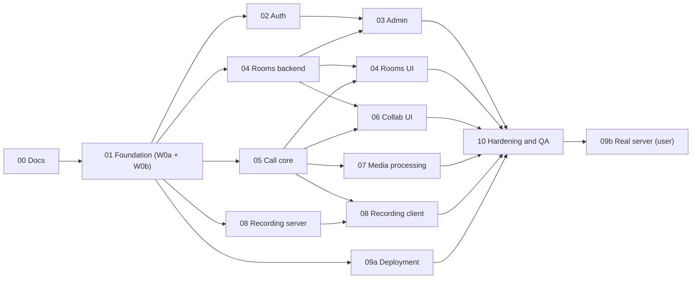

# Roadmap

This is the single place that tracks stage status, dependencies, waves and file ownership. Every stage has a
detailed file in `docs/stages/` with tasks and a Definition of Done (DoD).

Status values: `todo` → `in progress` → `review` → `done`. Only the orchestrator changes this table, after merging
and verifying a stage.

## Status

| Stage | Title | Owner(s) | Wave | Depends on | Status |
|---|---|---|---|---|---|
| [00](stages/00-docs-and-planning.md) | Docs and planning | orchestrator + doc agents | W0-docs | — | in progress |
| [01](stages/01-foundation.md) | Foundation | orchestrator (W0a); server-core, ui-shell, devops-ci (W0b) | W0 | 00 | in progress (W0a done) |
| [02](stages/02-auth-and-accounts.md) | Auth and accounts | auth | W1 | 01 | todo |
| [03](stages/03-admin-panel.md) | Admin panel | admin | W2 | 02, 04 (backend) | todo |
| [04](stages/04-rooms-invites-join.md) | Rooms, invites, join, E2EE keys | rooms-backend (W1), rooms-ui (W2) | W1 / W2 | 01; UI also 05 | todo |
| [05](stages/05-call-core.md) | Call core | call-core | W1 | 01 | todo |
| [06](stages/06-host-controls-collaboration.md) | Host controls and collaboration | collab-ui | W2 | 04 (backend), 05 | todo |
| [07](stages/07-media-processing.md) | Media processing | media-fx | W2 | 05 | todo |
| [08](stages/08-recording.md) | Recording | recording-server (W1), recording-client (W2) | W1 / W2 | 01; client also 05 and 08 (server) | todo |
| [09](stages/09-production-deployment.md) | Production deployment | infra (9a, W1); user (9b) | W1 / final | 01 (9a); 10 (9b) | todo |
| [10](stages/10-hardening-qa-release.md) | Hardening, QA and release | e2e, security-review, quality-review, fix agents, docs | W3 | all | todo |

## Dependency graph

## Waves and merge train

At most five sub-agents run at the same time. Each works in its own git worktree and branch. The orchestrator
merges, runs the full gate, and commits locally. **Nothing is pushed** until the user asks.

| Wave | Agents | Starts when |
|---|---|---|
| W0-docs | orchestrator, doc agent A (stages 00–05 + API), doc agent B (stages 06–10 + TESTING/DEPLOYMENT/PERFORMANCE/README) | now |
| W0a | orchestrator: scaffold, dependencies, configs, contracts, schema, stubs, dev stack, scripts | W0-docs merged |
| W0b | `server-core`, `ui-shell`, `devops-ci` | W0a committed (wave base SHA recorded below) |
| W1 | `auth`, `rooms-backend`, `call-core`, `recording-server`, `infra` | W0b merged |
| W2 | `admin` (after auth + rooms-backend), `rooms-ui` (after rooms-backend + call-core), `collab-ui` (after rooms-backend + call-core), `media-fx` (after call-core), `recording-client` (after call-core + recording-server) | each as soon as its dependencies are merged |
| W3 | `e2e`, `security-review`, `quality-review`, fix agents grouped by owner area, `docs` | W2 merged |
| Final | Stage 9b and the manual browser matrix | user |

**Merge gate** (after every merge):
- `pnpm lint`, `pnpm typecheck`, `pnpm test`, `pnpm test:api`, `pnpm build` and `pnpm check:english` pass.
- A clean `docker build` succeeds.
- The E2E smoke passes.
- This table is updated, the result is committed, and the worktree is removed.

Wave base SHAs (filled in by the orchestrator):

| Wave | Base SHA |
|---|---|
| W0b | c923e6d |
| W1 | — |
| W2 | — |
| W3 | — |

## Ownership map

Every path in the repository has exactly one owner at a time. Paths not listed under an agent belong to the
orchestrator. "Frozen" paths change only through the orchestrator, after an agent requests the change in its report.

### Orchestrator (frozen for everyone else)

- `package.json`, `pnpm-lock.yaml`, `pnpm-workspace.yaml`, `.node-version`, `.npmrc`
- `nuxt.config.ts`, `app.config.ts`, `tsconfig*.json`, `eslint.config.mjs`, `.prettierrc*`, `vitest.config.ts`,
  `playwright.config.ts`, `drizzle.config.ts`, `components.json`
- `.gitignore`, `.editorconfig`, `.dockerignore`, `.worktreeinclude`, `.claude/**`
- `AGENT.md`, `CLAUDE.md`, `docs/ROADMAP.md`, `docs/ARCHITECTURE.md`, `docs/SECURITY.md`, `docs/API.md`
- `.env.example`, `.env.dev.example`, `server/utils/env.ts`, `server/utils/api-error.ts`
- `server/database/**` (schema + migrations), `server/contracts/**` (server-internal interfaces)
- `shared/**` (schemas, error codes, permission matrix types, constants)
- `app/lib/contracts/**` (client-internal interfaces), `app/lib/e2ee/**` (key derivations, proof, envelope; key
  vault excepted, see rooms-ui), `app/composables/useApi.ts`
- `app/components/ui/**` (shadcn-vue), `app/layouts/**` and navigation after W0b
- `.github/workflows/**` and `docker-compose.dev.yml` after W0b

### W0b

| Owner | Paths |
|---|---|
| `server-core` | `server/middleware/**` (incl. the password-change guard), `server/plugins/**`, `server/utils/**` (except `env.ts` and `api-error.ts`), `server/tasks/maintenance/**`, `server/services/{session,settings,audit}/**`, `server/api/{health,ready,config}.get.ts`, `server/cli.ts`, `scripts/build-cli.mjs`, `tests/api/_harness/**`, `tests/api/core/**` |
| `ui-shell` | `app/app.vue`, `app/error.vue`, `app/assets/**`, `app/layouts/**`, `app/components/app/**`, `app/plugins/**`, `app/pages/index.vue`, `public/*` (not `public/vendor/**`), `tests/e2e/shell/**` |
| `devops-ci` | `.github/workflows/**`, `docker-compose.dev.yml` (refinements), `docker/e2e/**`, `docker/livekit/**`, `scripts/{check-english.mjs,worktree-setup.mjs,with-lock.sh,detect-ip.sh}`, `tests/e2e/fixtures/base.ts`, `docs/TESTING.md` |

### W1

| Owner | Paths |
|---|---|
| `auth` | `server/api/auth/**`, `server/api/me*`, `server/services/{auth,users,mail}/**`, `server/mail/**`, `app/pages/{login,register,invite,verify-email,forgot-password,reset-password,change-password}.vue`, `app/pages/settings/**`, `app/components/auth/**`, `app/composables/useAuth.ts`, `app/middleware/**`, `tests/api/auth/**`, `tests/e2e/auth/**` |
| `rooms-backend` | `server/api/{rooms,join,calls,webhooks}/**` (except `server/api/calls/[roomId]/recording/**`), `server/services/{rooms,invites,join,lobby,calls,meetings,livekit,guests}/**`, `server/tasks/rooms/**`, `server/testing/**` (fake LiveKit adapter endpoint, test/dev builds only), `tests/api/{rooms,join,calls,webhooks}/**`, `tests/e2e/fixtures/join.ts` (DB-backed join fixture via the real join API) |
| `call-core` | `app/dev/**` (harness pages, registered only in dev/test builds), `app/components/call/**` (except the Wave-2 feature folders listed below), `app/lib/{livekit,layout}/**`, `app/lib/call/**` (except Wave-2 feature folders), `app/stores/call*.ts`, `app/composables/call/**`, `tests/e2e/call/**`, `tests/e2e/fixtures/livekit.ts` |
| `recording-server` | `server/api/recordings/**`, `server/api/calls/[roomId]/recording/**`, `server/api/admin/recordings/**`, `server/services/recordings/**`, `server/tasks/recordings/**`, `server/plugins/recordings*.ts` (sync bus subscriber), `app/pages/recordings/**`, `app/pages/admin/recordings.vue`, `app/components/recordings/**`, `tests/api/recordings/**`, `tests/fixtures/media/**` |
| `infra` | `Dockerfile`, `.dockerignore` (request), `docker/{app,caddy}/**`, `docker-compose.yml`, `scripts/{init-env.sh,preflight.sh,smoke-prod.sh}`, `tests/smoke-prod/**`, `README.md`, `docs/DEPLOYMENT.md` |

### W2

| Owner | Paths |
|---|---|
| `admin` | `server/api/admin/**` (except `recordings/**`), `server/services/admin/**`, `app/pages/admin/**` (except `recordings.vue`), `app/components/admin/**`, `tests/api/admin/**`, `tests/e2e/admin/**` |
| `rooms-ui` | `app/pages/{dashboard,rooms}/**`, `app/pages/m/**`, `app/components/{rooms,join}/**`, `app/lib/join/**`, `app/composables/rooms/**`, `app/lib/e2ee/key-vault.ts` (+ test), `tests/e2e/{rooms,join}/**` |
| `collab-ui` | `app/lib/call/features/{participants,lobby,chat,reactions,hands,host-actions,room-settings}/**`, `app/components/call/{participants,lobby,chat,reactions,host}/**`, `tests/e2e/collab/**` |
| `media-fx` | `app/lib/media/**`, `app/lib/call/features/effects/**`, `app/components/call/effects/**`, `scripts/vendor-assets.mjs`, `public/vendor/**`, `tests/e2e/media/**` |
| `recording-client` | `app/lib/recording/**`, `app/lib/call/features/recording/**`, `app/components/call/recording/**`, `tests/e2e/recording/**` |

### W3

- `e2e`: `tests/e2e/**` (all specs and fixtures, after W2 merges), `tests/load/**`, `tests/perf/**`,
  `tests/api/security/**`, `docs/PERFORMANCE.md`.
- `security-review` and `quality-review` are read-only and produce reports.
- Fix agents get the owning area of each finding.
- `docs`: `docs/**` (except files the orchestrator owns), `README.md`, `CHANGELOG.md`.

Stage files: each owner ticks the checkboxes in its own `docs/stages/NN-*.md`.

## Backlog (not in v1)

- Mid-call key rotation (distribute a new key to remaining participants, for example after a removal)
- Chat history for late joiners (peer-to-peer sync, E2EE preserved)
- Private chat messages
- Virtual backgrounds (images)
- OIDC providers (Keycloak, Authentik, Google Workspace): the architecture is ready (`AuthProvider`,
  `auth_identities`)
- Multi-node deployment (Redis for LiveKit, shared event bus and limiter stores)
- Scheduled meetings and calendar integration (client-side invites only, never server-sent room links)
- Published container images on GHCR (workflow prepared, not run)

## Change log

- 2026-09-28 — Roadmap created from the approved plan.
